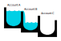
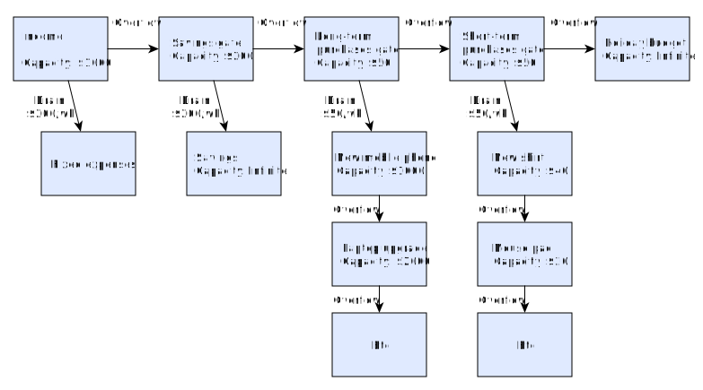

# Ice Tray Financial Engine

I built this for my personal budgeting.

The engine calculates the state of virtual "accounts", managed by performing _actions_ (such as creating an account, or injecting money).

## The Concept

The accounts in this model do not follow the traditional rules of accounting. They follow what I'm calling the "ice-tray" model. When you fill up an empty ice cube tray with water, the water flows into one of the wells (excluding splashing etc) and then _overflows_ into the neighboring wells, which then fill up until they in turn overflow, and so it continues.

The wells in an ice cube tray are analogous to the accounts in this financial model, and the water is analogous to the money. I originally used something like this to save up for a list of things I wanted to buy: money can flow into the first item on the list, and then overflow to the second, etc, until the list is complete. When an item is full, I know I can purchase that item. It provides a controlled way of curbing my spending on certain things.

This concept is easiest seen in a representational diagram:

In the diagram, account A has reached capacity and is overflowing into account B. Account B has not yet reached capacity and so is not yet overflowing into account C.

Note: although the model uses the term "account" to represent each well of money, the intention is for this to be used on a more fine-grained basis. For example, a separate account may be created for each item in a list of purchases you want to make (this is up to the application that builds on the ice-tray model, and is not a feature supported by the ice tray model itself)

Accounts in this model have the following configurable properties:

 - A capacity (the amount of money they can hold before they overflow)
 - An overflow target: where the money goes when it overflows
 - A set of drains, where money will continually "leak out" of each drain at a constant flow rate into respective target accounts.

Some may recognize the drain as a way of representing the [Leaky Bucket](https://en.wikipedia.org/wiki/Leaky_bucket) algorithm which is used in computer science to limit bursty network traffic, among other things. Here it is useful to similarly regulate bursty purchases.

### Piecewise Linear

Another feature that distinguishes this model from a traditional accounting system, is the fact that flow rates are considered first-class. That is, accounts are not considered to be static over time with a fixed level until explicitly changed, but instead change continuously as money drains out of them or drains into them from another account (or both).

The representation of accounts states can be considered to be piecewise linear, meaning that things change continuously in a linear way until some non-linearity event is encountered. A non-linearity event can be from a user action (e.g. a user puts money into an account), or because the system reaches a transition point such as an account reaching capacity and starting to overflow.

## Account Behavior

This section describes the way the model behaves, and the rules it adheres to.

Accounts must always have a non-negative fill level (i.e. the balance), and a fill rate.

If the account has an overflow target, the fill level will never exceed the _capacity_ of the account. Any excess balance or flow will be forwarded to the overflow target. If there is no overflow target, then the fill level can grow indefinitely.

When there is balance in an account, each drain of the account consumes the balance gradually at the constant flow rate defined by the respective drain.

If there is no balance on the account, but there is inflow into the account (i.e. the potential drain outflow rate exceeds the inflow rate), then that inflow is divided proportionately between the drains. Note that this has the same end effect as injecting the inflow in small discrete doses to the balance of the account, and letting the small balance drain until empty.

Inflow to an account with no capacity will go to the drains before the overflow. Only if the drains are completely satisfied will any excess inflow go to the overflow target.

## Justification with Example

It might be easiest to see how this model is useful by means of an example.

In the following example account graph, each node is an account. Edges (connections) within the graph represent flows between accounts, either as overflows or drains.

This example is for a hypothetical person working on an hourly basis. They inject money into their "income" account when they earn it each day or each hour. This income drains continuously into their fixed expenses, at a rate of $200/wk. Fixed expenses might represent things like rent, electricity, phone bill, etc.

The capacity of the income account here is $1000. This represents a buffer to pay off fixed expenses in between earnings. Since here the fixed expenses are draining at $200/wk, it means that this person could last 4 weeks without income before they would stop being able to pay their rent.

When the income buffer account is full (exceeds $1000), any extra income overflows into what I here called the "savings gate" account, which exists to leech off money into a savings account.

The savings gate here has a capacity of $200, and a drain of $200 per week, so if inflow to the gate stops then the savings account will stop getting money after 1 week (when the gate runs dry).

Again, this is utilizing the principles of the [Leaky Bucket](https://en.wikipedia.org/wiki/Leaky_bucket) algorithm, to regulate the continuous flow into savings from a discrete/bursty income source.

If you earn enough in a week to overflow both the "income" and "savings gate" accounts, then money flows into the long-term purchases gate. Similarly to the savings gate, the long-term purchases gate bleeds off money into long-term purchases, with a buffer to manage burstiness in the income source. Here, each long-term purchase that the person cares about is represented as an account in an overflow cascade.

When the balance on a particular purchase (e.g. a mobile phone) reaches capacity, the user knows that sufficient funds have been reserved towards that purchase, so that the purchase can be made in real life (after which the account might be deleted).

Note that balances are not shown in this diagram (the balances and effective rates are what this library calculates, given a graph like this).

